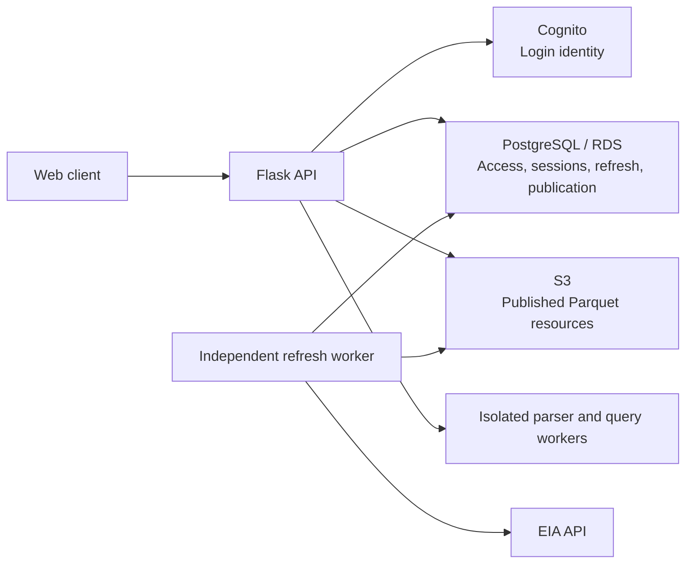

# Architecture

Outage Explorer lets authorized users browse stored nuclear outage data, preview
observations, run read-only SQL and request a data refresh.

The backend is **one layered Python/Flask monolith**. HTTP handlers, refresh and
analytical workers share its codebase; they have different process lifecycles.
The Next.js web client lives in the
[separate web repository](https://github.com/PedroEdu6786/outage-explorer-web).

Use this page for the system overview. Use [code structure](code-structure.md)
to decide where code belongs, [module/endpoint diagrams](module-diagrams.md) for
individual flows, and [first-time setup](../development/fresh-machine.md) to run it.

## Main components

| Component | Responsibility |
| --- | --- |
| Web client | Pages, sign-in navigation, data exploration and refresh controls. |
| Flask API | HTTP transport and application use cases; authorization before protected work. |
| Cognito | Provider login and verified identity. Application roles come from PostgreSQL. |
| PostgreSQL on RDS | Users/roles, login attempts, sessions, refresh coordination and active-generation descriptors. |
| S3 | Exactly three immutable Parquet resource files per generation. |
| Parser/query workers | Bounded SQL inspection and isolated analytical execution over authorized inputs. |
| Refresh worker | Fetch EIA data, construct/verify candidate files and publish successful generations. |

Concrete adapters are built and injected by `bootstrap.py`. Domain rules are
pure; application services orchestrate use cases through ports; infrastructure
implements storage/provider/engine operations; entrypoints translate transport.
See [ADR-0030](../adr/0030-layered-flask-monolith.md) and the
[dependency matrix](code-structure.md#dependency-matrix).

## What runs where locally

The selected development environment is Apple Silicon macOS with the dedicated
Colima `outage-runtime` Linux VM. Its Linux controls support parser/worker
resource limits and the private ext4 spill filesystem.

| Process | Location | How it starts |
| --- | --- | --- |
| Web client | macOS | `npm run dev` in the web checkout. |
| API and trusted analytical controller | Colima Linux guest | `make run-analytical` from the backend checkout. |
| SQL inspection subprocess and analytical Docker workers | Colima Linux guest | Started by the API's explicit runtime lifecycle as needed; no separate developer command. |
| Independent refresh worker | macOS | `make run-worker` when refresh processing is intended. |

`make local-forward` exposes the guest API at macOS `localhost:8000`; reuse an
existing working tunnel instead of starting another. The API supervisor renews
AWS credentials privately. Analytical workers receive no cloud credentials,
operational database, daemon socket, network or unrelated cache paths.

Local preview/SQL acceptance uses one threaded API process and one analytical
execution slot. Refresh has its own supervisor: API shutdown does not stop a
healthy refresh worker. Imports and app factories start no connections, jobs or
threads. See [daily development](../development/local-setup.md) for commands.

## Login and authorization

1. The API creates a bounded, browser-bound, single-use login attempt.
2. Cognito completes Authorization Code with PKCE; its adapter exchanges the code
   and verifies the identity.
3. The application resolves that identity to a seeded PostgreSQL user with
   exactly one role and creates a fixed-expiry session.
4. Every protected use case resolves the current session/role before data access,
   including preview continuations and SQL result pages.

| Role | Access |
| --- | --- |
| Viewer | National data only. |
| Analyst | All analytical datasets, previews and SQL. |
| Admin | Analyst capabilities plus refresh admission and status. |

Cognito claims/scopes do not grant application roles. Registration and Admin user
management are excluded. There are no per-user grants or row/column access policies.
Sessions default to one hour without automatic renewal; logout revokes the current
session. Expired login attempts are reclaimed before new admission. HTTP handles
cookies, Origin/CORS and safe responses; the application/security boundary checks
CSRF. See the [auth contract](../specs/user-access/http-contract.md).

## Preview and SQL requests

1. Authenticate and authorize the requested dataset scope. For user SQL,
   authenticate before bounded subprocess inspection and authorize the complete
   inspected references before fetching analytical inputs.
2. Select the published generation and exact resource descriptors from PostgreSQL.
3. Fetch/check the approved resource through the bounded cache and pin it against
   eviction. Stage only authorized files for the isolated worker.
4. Execute over public-column views of those files, preserving private provenance
   inside the physical files. There is no API-process DuckDB/parser fallback or
   whole-input reconstruction per request.
5. Return a bounded preview or retain the SQL result for subsequent page reads.

SQL executes **once**. Paging reads that retained execution, preserving order,
multiplicity and explicit SQL clauses; it never injects pagination SQL or silently
reruns the query. Fresh access and original-owner checks apply to result pages.
Preview/query metadata is process-owned and in memory, not PostgreSQL.
Continuations expire after 60 seconds without renewal; restart/expiry requires an
explicit new preview or query. Pages default to 100 rows, up to 500; SQL output
is capped at 1,000 rows or 1 MiB with explicit truncation.

The runtime bounds admission, CPU, memory, process count, time, transport and
spill storage. Ownership intent is recorded before staging allocation; uncertain
termination retains the slot and pins until cleanup is confirmed. Reviewed
host/image/parser identities and Linux quota prerequisites are startup gates.
These mechanisms do not by themselves establish production capacity.

See the [endpoint diagrams](diagrams/endpoints.md),
[HTTP contract](../specs/data-api/http-contract.md) and
[runtime runbook](../../infrastructure/analytical-worker/README.md).

## Refresh and publication

1. An Admin request admits a run with frozen settings: configured start through
   today's UTC date. Callers cannot override the dates; there is no fixed
   183-day HTTP ceiling. Replay is scoped to the authenticated application user's
   ID and the digested `Idempotency-Key`: the same user/key returns the original
   run and frozen configuration. Another user's identical key is a separate
   identity, subject to the single active refresh limit.
2. The independent worker claims the run using a database-time lease and restores
   its pinned baseline. The API never fetches EIA data in the request lifecycle.
3. The worker retrieves bounded EIA inputs, applies pure validation/merge rules
   and constructs all three resource files. All source workers in a run share
   request pacing and throttle cooldowns; retry waits remain cancellable and
   count against the retrieval deadline. Invalid replacements, absent keys
   and wholly excluded routes retain prior valid data; initial loading needs
   usable data in every grain.
4. Persist and fully read back every exact S3 resource. A durable receipt alone
   does not activate data.
5. Recheck ownership/lease/baseline and atomically commit exact descriptors,
   quality, successful outcome and the active pointer in PostgreSQL.

Failures preserve the previous valid generation; existing readers retain their
selected snapshot. All-excluded refreshes keep the active generation. Fence stale
owners and reconcile publication after worker loss. Interrupted unpublished work
requires explicit Admin retry, never an automatic source rerun. Application
transactions stay short and do not hold PostgreSQL writes across external I/O.

See the [connector diagram](diagrams/data-connector.md),
[refresh worker instructions](../development/connector.md#product-refresh-worker),
[retention decision](../adr/0037-connector-initial-load-and-retention.md) and
[recovery decision](../adr/0052-interrupted-refresh-recovery.md).

## Where state lives

| Storage | Contents and lifetime |
| --- | --- |
| RDS PostgreSQL | Durable operational state and exact publication descriptors; authoritative active-generation pointer. |
| S3 | `national.parquet`, `facilities.parquet`, `generators.parquet` under `<prefix>generations/<generation-id>/`. |
| Private local files | Bounded transient source/candidate inputs, verified cache/staging, spill, retained result output and the execution recovery ledger. |
| API process memory | Expiring preview cursors, query IDs and query/result ownership metadata; lost on API restart. |

Physical resource files retain private provenance, original numeric strings,
units, natural identity and exact calculation evidence. Analytical views expose
only the public columns. There are no daily modeled partitions, supporting S3
graph, manifest or duplicate public resource files. Legacy publication rows
without exact descriptors fail closed; there is no automatic conversion or
publication reset. See [ADR-0060](../adr/0060-persist-only-three-resource-files-per-generation.md),
[ADR-0061](../adr/0061-generation-prefixed-resource-object-keys.md) and
[ADR-0064](../adr/0064-remove-obsolete-manifest-publication-columns.md).

PostgreSQL is also used for local integration tests; unit tests may use fakes.
There is no implicit SQLite fallback. The [data model](data-model.md) documents
entities, grains, public columns and calculation semantics.

## Acceptance and deployment scope

The user accepted local integration and authorized local API activation. The
reviewed preview/SQL scope keeps **refresh idle**; full high-water/spill,
S3 performance and simultaneous API/refresh capacity evidence remain separate
open checkpoints. Initial limits are not measured production budgets.
See [ADR-0053](../adr/0053-local-single-owner-analytical-acceptance.md),
[ADR-0055](../adr/0055-scoped-local-analytical-readiness.md) and
[ADR-0056](../adr/0056-user-directed-local-api-activation.md).

EC2 is the accepted deployment target, but final topology, ingress/TLS,
supervision, storage provisioning and capacity are not settled by local
acceptance. Local development does not require an EC2 instance
([ADR-0038](../adr/0038-ec2-deployment-local-development.md)).

For dated results and remaining evidence, use the
[runtime evidence map](../specs/data-api/runtime-evidence.md),
[auth verification](../specs/user-access/verification.md) and
[refresh checkpoints](../specs/refresh-persistence/tasks.md).
Historical tests and documentation edits do not grant new service startup,
external validation, refresh, publication reset or deployment authorization.
