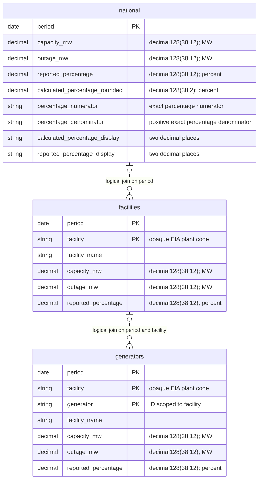
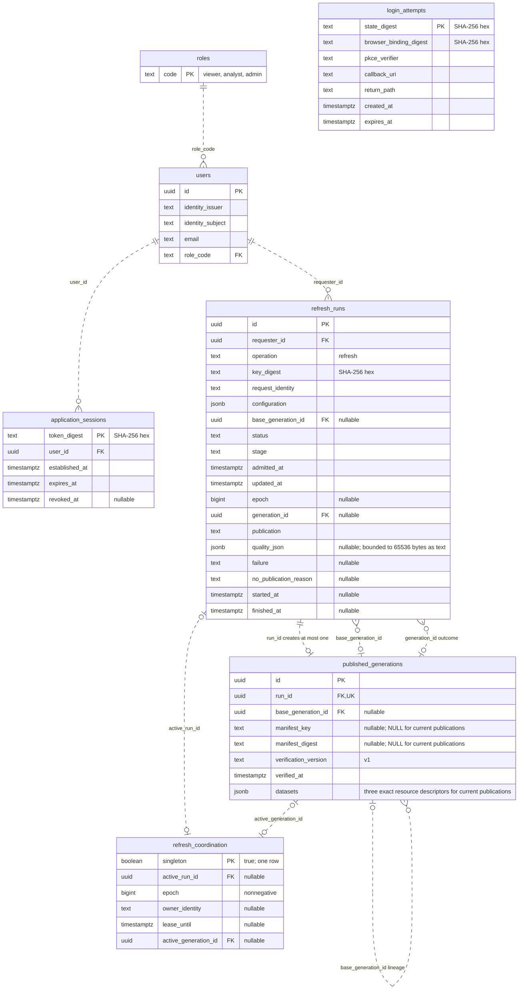

# Data model and entity relationship diagrams

This is the ER diagram and schema reference for the challenge's Part 2 model
and delivery requirements, covering backend specification TR4/TR5. It describes
the implemented source as of October 6, 2026: three analytical datasets and
seven operational product tables. Mermaid diagrams render directly on GitHub.

Sources of truth are the [public dataset definitions](../../src/outage_explorer/domain/datasets.py),
[physical Parquet schemas](../../src/outage_explorer/infrastructure/parquet/schemas.py),
and [PostgreSQL migrations](../../src/outage_explorer/infrastructure/postgresql/migrations/versions/).
This document includes migration `0004_refresh_resource_files` in the current
workspace; it does not assert that this migration has run on RDS. Resource-file
composition/cutover still follows the [refresh-persistence checkpoints](../specs/refresh-persistence/tasks.md).

## Analytical observations

Each entity below is a public DuckDB view over an authorized, staged Parquet
resource, not a PostgreSQL table. Keys are natural keys **within one generation**;
the ingestion/verification pipeline enforces uniqueness, since Parquet has no
primary-key or foreign-key constraints. All public fields are non-null.

The optional parent cardinalities describe join matches, not a guarantee of
complete source coverage. A facility observation can match at most one national
observation on `period`; a generator observation can match at most one facility
observation on `(period, facility)`. Missing matches do not invent parent rows
or invalidate an otherwise usable observation. Use outer joins when investigating
coverage. National-to-generator comparison also uses `period`, after aggregating
generator values. Always compare observations from the same generation.

| Dataset / resource file | One row represents | Natural key | Source route |
| --- | --- | --- | --- |
| `national` / `national.parquet` | One national daily observation | `period` | `us-nuclear-outages` |
| `facilities` / `facilities.parquet` | One facility daily observation | `(period, facility)` | `facility-nuclear-outages` |
| `generators` / `generators.parquet` | One generator daily observation at a facility | `(period, facility, generator)` | `generator-nuclear-outages` |

`facility` and `generator` remain strings, preserving leading zeros and
alphanumeric IDs. A generator ID alone is not globally unique. Names are
attributes of observations and can change; they are never join keys. There are
no separate facility/generator master tables, date dimension or persisted metric
table. The SQL view names above are the implemented names, superseding the
early proposed names in ADR-0002.

Source mapping is `period` → date, `facility`/`generator` → unchanged identifiers,
`facilityName` → `facility_name`, `capacity` → `capacity_mw`, `outage` →
`outage_mw`, and `percentOutage` → `reported_percentage`. The three numeric
source attributes must be finite decimal strings. Their units must be exactly
`megawatts`, `megawatts`, and `percent`, respectively. Capacity must be positive;
zero outage is valid. The contracts do not infer further physical bounds.

The national fleet metric is `100 × outage_mw / capacity_mw` from the selected
national observation. Exact rational numerators/denominators retain calculation
evidence; display uses two decimals, half-up rounding. It is not an average of
facility/generator percentages. Keep source national values and cross-grain
sums independent so discrepancies remain visible. See the
[national contract](../specs/national-data-verification/contract.md) and
[detail contracts](../specs/facility-generator-verification/contract.md).

## Physical resource schema and provenance

Under [ADR-0060](../adr/0060-persist-only-three-resource-files-per-generation.md),
each generation has exactly three unified resource files. Their S3 keys are
`<configured-prefix>generations/<generation-id>/{national,facilities,generators}.parquet`
([ADR-0061](../adr/0061-generation-prefixed-resource-object-keys.md)). Generation
identity belongs to the object descriptor/path, not an added observation column.

Each physical resource includes `period`, `facility_name`, the applicable
`facility`/`generator` identifiers, all three decimal measurements, and
`calculated_percentage_rounded` shown above. It also contains the fields below.
All physical fields are non-null except national `facility_name`, which is null;
national has no physical `facility` or `generator` columns. Facilities have no
`generator` column. National's extra percentage fields are public; the same
calculation fields in detail resources remain private.

| Physical field(s) | Arrow type | Meaning / exposure |
| --- | --- | --- |
| `identity` | `list<string>` | Private natural identity: `[]`, `[facility]`, or `[facility, generator]`; list elements are non-null |
| `origin` | `struct` | Private embedded source provenance; fields below |
| `capacity_source`, `outage_source`, `reported_percentage_source` | `string` | Private original numeric strings |
| `capacity_units`, `outage_units`, `reported_percentage_units` | `string` | Private original unit strings |
| `share_numerator`, `share_denominator` | `string` | Private exact `outage / capacity` rational components |
| `percentage_numerator`, `percentage_denominator` | `string` | Exact percentage components; public only in national |
| `calculated_percentage_display`, `reported_percentage_display` | `string` | Two-decimal display strings; public only in national |

| Embedded `origin` field(s) | Arrow type |
| --- | --- |
| `grain`, `run_id`, `retrieval_id`, `request_id`, `page_id` | `string` |
| `retrieved_at` | `timestamp[us, UTC]` |
| `page_index`, `row_index`, `source_position` | `int64` |
| `contract_id`, `transformation_id`, `evidence_id` | `string` |

All origin members are non-null. `origin.run_id` identifies the source candidate,
not necessarily the generation's publishing HTTP refresh run: CLI candidates
exist and retained observations keep their original provenance. It is not a
PostgreSQL foreign key. Origin is embedded once per observation, not a fourth
durable file or a separate relational table. Raw responses, page metadata,
dispositions and merge ledgers are transient candidate inputs. Analytical
[views](../../src/outage_explorer/infrastructure/duckdb/views.py) explicitly
project only public columns; private resource fields are not SQL-visible.

## PostgreSQL operational entities

These relationships are enforced by PostgreSQL foreign keys. `PK`, `FK`, and
`UK` mean primary, foreign, and unique key. A comment of `nullable` denotes an
optional column; every other column is `NOT NULL`. Composite unique constraints
are listed after the diagram rather than marking their members individually.

`published_generations` is the current publication table. New publications store
three exact resource descriptors in `datasets`; both manifest columns are NULL.
The diagram includes those retained columns because they still exist in the
schema to identify historical manifest-format rows, which current readers reject
under [ADR-0062](../adr/0062-fail-closed-legacy-publication-layout.md).

- Each user has exactly one role; a role can have zero or many users. The
  `(identity_issuer, identity_subject)` pair is unique. Email is not a unique
  identity key. Cognito owns credentials; there is no application password column.
- A user can have independent sessions. Session token digests, user binding,
  establishment and expiry are immutable; logout records revocation. Expiry must
  follow establishment, and revocation cannot precede establishment.
- Login attempts deliberately have no user FK: they exist before authentication
  identifies a local user. State and browser bindings are digests; the bounded
  PKCE verifier is temporary login state. Expiry must follow creation.
- Refresh idempotency uses unique `(requester_id, operation, key_digest)`.
  Admission snapshots configuration and the nullable base generation. Admission
  fields are immutable, and refresh history cannot be deleted. Status/stage and
  publication-state constraints describe progress and outcomes; only `succeeded`
  requires `publication = 'published'` and a non-null outcome generation.
- A published generation belongs to exactly one refresh run; unique `run_id`
  permits at most one publication per run. The nullable self-reference preserves
  baseline lineage. The separate `refresh_runs.generation_id` is an outcome
  reference; its FK alone does not enforce a reciprocal match to `run_id`.
  Publication orchestration owns that consistency. Published rows are immutable.
- Coordination has a single `true` primary-key row. Its active run/generation
  pointers are optional; they select work/data without deleting history.
  Owner and lease are either both present or both absent; an owner requires an
  active run. Epochs fence stale worker ownership.

Alembic also maintains `alembic_version(version_num varchar(32) PRIMARY KEY)`
as migration bookkeeping, with no product relationships. Query IDs, preview
continuations, result files and cache pins are process-owned ephemeral state;
there are no PostgreSQL tables for them.

## Generation descriptors and storage relationships

For a resource-format publication, `published_generations.datasets` embeds
exactly one descriptor for each grain (`national`, `facility`, `generator`).
These are JSON objects, not three more PostgreSQL tables. Each descriptor
identifies one exact durable Parquet resource; that resource contains many
observations. All fields below are required for this layout.

| JSON field | JSON type | Constraint / meaning |
| --- | --- | --- |
| `grain` | string | Unique within generation; one of the three grains |
| `schema_version` | string | `v1` |
| `rows` | number | Positive integer row count |
| `start`, `end` | string | Inclusive ISO date coverage, start ≤ end |
| `object_key` | string | Unique within generation; exact generation-prefixed S3 key |
| `sha256` | string | Lowercase 64-character hex content digest |
| `byte_count` | number | Positive integer size |

The database validates this descriptor array for resource-format rows under
migration 0004. `manifest_key` and `manifest_digest` are both null in that layout.
Historical manifest-format rows retain both values and their original dataset
summaries; they are not backfilled. Resource readers fail closed on an active
legacy layout under [ADR-0062](../adr/0062-fail-closed-legacy-publication-layout.md).
The presence of legacy columns is not a requirement for new S3 manifests or
permission to reset the active pointer. Quality summaries belong to
`refresh_runs.quality_json`; uploading resource files alone does not publish them.

## Duplicate, invalid and refresh behavior

Validation precedes selection. For a natural key, the valid observation with
greatest recorded source position wins; equal earlier values are duplicates,
different earlier values are superseded. Numeric spelling differences compare
by parsed value, while original strings remain available. An invalid later row
never displaces an earlier valid row. Source position is a reproducible selection
rule, not proof of upstream revision recency.

Invalid required values are excluded with reasons. Decimal values must also fit
the physical precision/scale exactly; representation failures are not silently
rounded into storage. Later refreshes retain absent prior keys and wholly
excluded routes while applying other valid updates; an entirely excluded refresh
retains the active generation. First publication needs usable output in all
three grains. See [ADR-0037](../adr/0037-connector-initial-load-and-retention.md).

These rules establish per-grain integrity without asserting that generator sums
equal facility values or facility sums equal national values. Reconciliation and
actual anomalies remain separate evidence in [FINDINGS.md](../../FINDINGS.md).
An ER diagram does not close the outstanding reconciliation, runtime-readiness
or deployment checkpoints.
