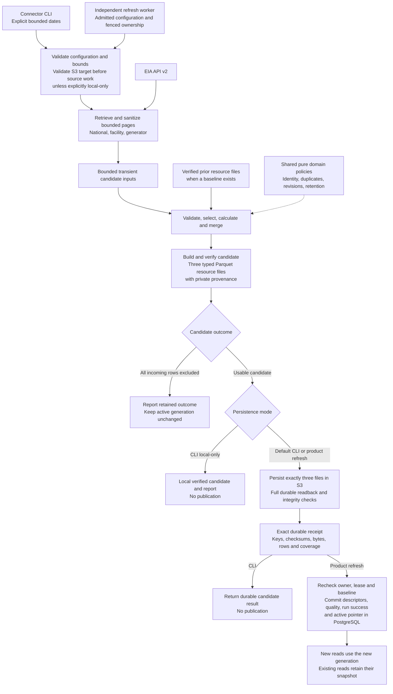

# Data connector: high-level flow

The connector retrieves all three EIA grains and constructs a verified candidate.
Persistence makes its three files durable; the product refresh workflow separately
publishes them. A contributor CLI run never activates product data.

Each resource file is `national.parquet`, `facilities.parquet` or
`generators.parquet` under the configured generation prefix. Raw pages,
dispositions and merge ledgers are transient; no supporting S3 graph or manifest
is produced. Failed retrieval, exhausted bounds or failed durable readback
cannot become success through a local-only fallback. Publication uncertainty
requires reconciliation, not a blind retry or pointer change.

| Responsibility | Source |
| --- | --- |
| Candidate orchestration | [CreateResourceCandidate](../../../src/outage_explorer/application/services/connector.py) |
| EIA retrieval and sanitization | [EIA adapters](../../../src/outage_explorer/infrastructure/eia/) |
| Candidate inputs, building and verification | [Parquet adapters](../../../src/outage_explorer/infrastructure/parquet/) |
| Durable persistence and recovery | [Resource artifact services](../../../src/outage_explorer/application/services/resource_artifacts.py) |
| Product execution and publication orchestration | [Refresh execution](../../../src/outage_explorer/application/services/refresh_execution.py) |
| Durable coordination/publication | [PostgreSQL publication](../../../src/outage_explorer/infrastructure/postgresql/publication.py) |

The diagram shows the current composed source, not a newly executed live run.
Initial publication needs usable data in every grain. Later merges preserve
absent/invalid prior rows under [ADR-0037](../../adr/0037-connector-initial-load-and-retention.md).
An active base without exact resource descriptors fails closed under
[ADR-0064](../../adr/0064-remove-obsolete-manifest-publication-columns.md), which
removes the obsolete manifest columns and publication adapter.

[All module diagrams](../module-diagrams.md) · [Decisions](../../../DECISIONS.md)
