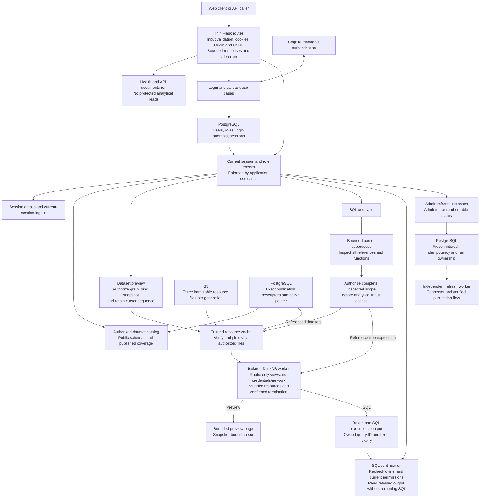

# API endpoints: high-level responsibilities

Flask routes validate transport inputs and call injected application services.
Application use cases enforce current local roles before protected work.
Cognito supplies identity; PostgreSQL owns local users, roles and sessions.

The branches share authorization policy, not a route-owned authorization engine.
Preview pages can perform bounded worker reads on their pinned snapshot. SQL
continuation pages read a retained execution and never execute SQL again.
Catalog uses application definitions and PostgreSQL metadata, without downloading
analytical files. Reference-free SQL skips generation/file preparation after
inspection and authorization; it still uses isolated execution and result bounds.
Only the trusted loader accesses S3; analytical/parser workers receive no cloud
or operational-database credentials. Refresh runs outside the HTTP lifecycle.

| Capability | HTTP operations |
| --- | --- |
| Health / documentation | `GET /health`, `GET /api/docs`, `GET /api/openapi.json` |
| Authentication / session | `GET /api/auth/login`, `GET /api/auth/callback`, `GET /api/auth/session`, `POST /api/auth/logout` |
| Catalog / preview | `GET /api/datasets`, `GET /api/datasets/{dataset}/preview` |
| SQL execute / retained pages | `POST /api/query`, `GET /api/query` |
| Admin refresh / status | `POST /api/refresh`, `GET /api/refresh/latest`, `GET /api/refresh/{run_id}` |

Viewer accesses national data; Analyst/Admin access all three grains; refresh and
its protected diagnostics require Admin. Transport enablement and reviewed
analytical startup remain explicit composition steps. This diagram does not
claim fresh live persona, isolation or deployment acceptance.

Sources: [HTTP routes](../../../src/outage_explorer/entrypoints/http/routes/),
[application services](../../../src/outage_explorer/application/services/),
[data HTTP contract](../../specs/data-api/http-contract.md),
[auth HTTP contract](../../specs/user-access/http-contract.md).

[All module diagrams](../module-diagrams.md) · [Decisions](../../../DECISIONS.md)
