# API endpoints: individual flow diagrams

Each HTTP operation has its own high-level diagram below. Flask handles transport;
application services enforce current identity and role before protected work.
Reviewed against current workspace source on October 7, 2026. These diagrams
explain responsibilities, not fresh live acceptance or deployment.

Common behavior: protected errors omit secrets and unauthorized schema details;
configured transport applies credentialed CORS, exact Origin/CSRF rules for
mutations and no-store responses. OPTIONS preflight is shared transport behavior,
not a separate product use case. Concrete services are injected at startup;
imports and app factories start no jobs. Optional services still require explicit
configuration/analytical startup. Invalid inputs and failed dependencies return
safe errors rather than continuing along the successful paths shown.

| HTTP operation | Diagram |
| --- | --- |
| `GET /health` | [Health](#health) |
| `GET /api/docs` | [API documentation](#api-documentation) |
| `GET /api/openapi.json` | [OpenAPI contract](#openapi-contract) |
| `GET /api/auth/login` | [Begin login](#begin-login) |
| `GET /api/auth/callback` | [Complete login](#complete-login) |
| `GET /api/auth/session` | [Current session](#current-session) |
| `POST /api/auth/logout` | [Logout](#logout) |
| `GET /api/datasets` | [Dataset catalog](#dataset-catalog) |
| `GET /api/datasets/{dataset}/preview` | [Dataset preview](#dataset-preview) |
| `POST /api/query` | [Execute SQL](#execute-sql) |
| `GET /api/query` | [Read SQL result page](#read-sql-result-page) |
| `POST /api/refresh` | [Admit refresh](#admit-refresh) |
| `GET /api/refresh/latest` | [Latest refresh](#latest-refresh) |
| `GET /api/refresh/{run_id}` | [Refresh status](#refresh-status) |

## Health

`GET /health`

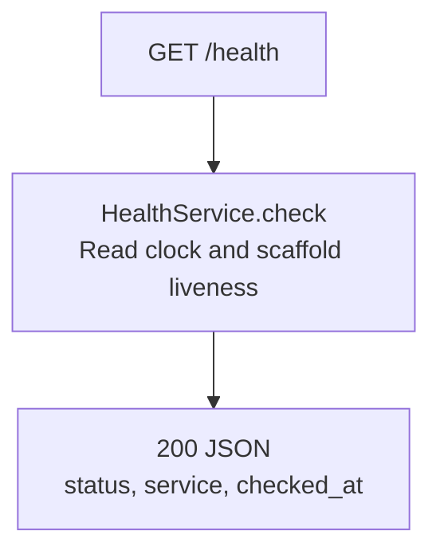

Public liveness only. Does not query PostgreSQL, Cognito, S3 or DuckDB and does not establish readiness.

## API documentation

`GET /api/docs`

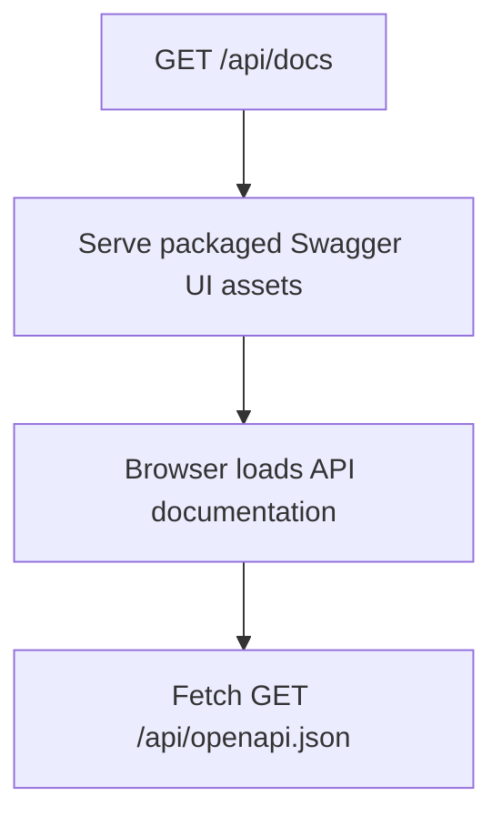

Public documentation. Trying protected operations still requires their normal authentication, authorization and configured resources.

## OpenAPI contract

`GET /api/openapi.json`

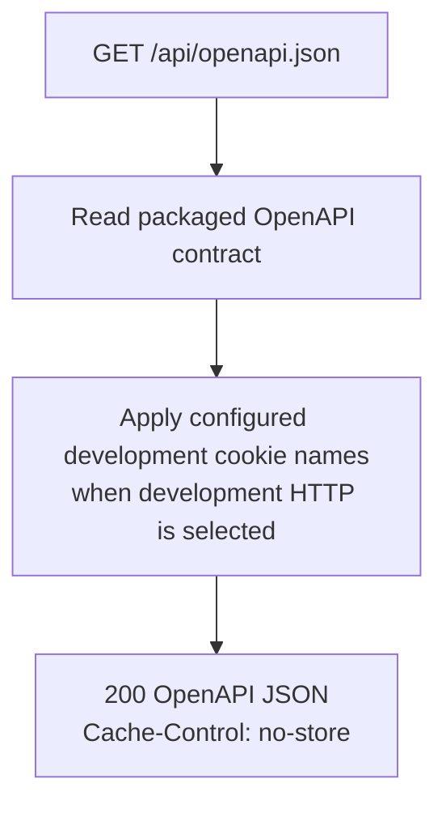

Public contract metadata; serving the contract starts no connector or analytical worker.

## Begin login

`GET /api/auth/login`

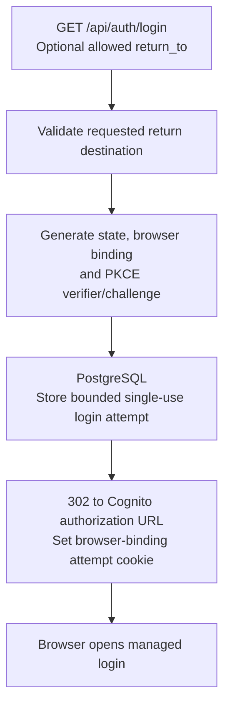

Login establishes an attempt, not an application session. Invalid destinations are rejected before creating it.

## Complete login

`GET /api/auth/callback`

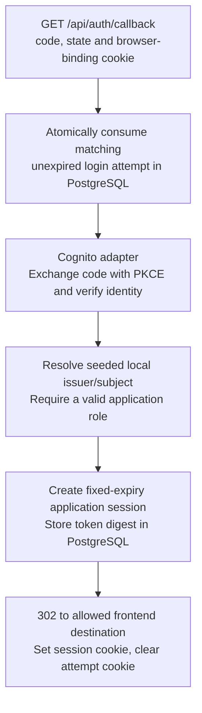

No local session is created for invalid/replayed attempts or an unlinked identity. Callback failures also clear the attempt cookie; provider work is outside the attempt-consumption transaction.

## Current session

`GET /api/auth/session`

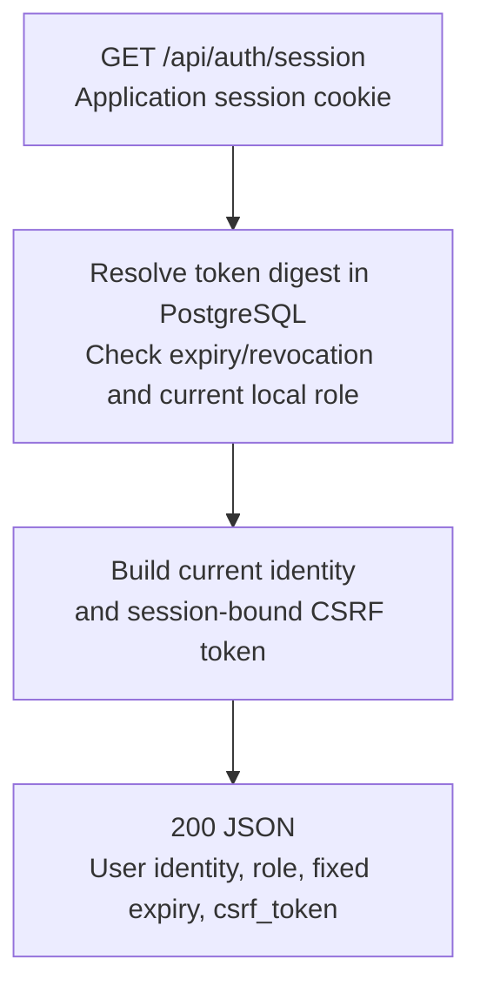

Unauthenticated or expired sessions fail. Reading the session does not renew its expiry or access analytical data.

## Logout

`POST /api/auth/logout`

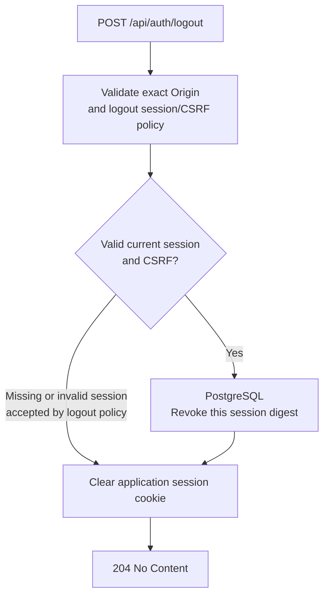

Invalid Origin or invalid CSRF on a valid session is rejected. Logout invalidates only the current application session; Cognito browser logout is a separate client flow.

## Dataset catalog

`GET /api/datasets`

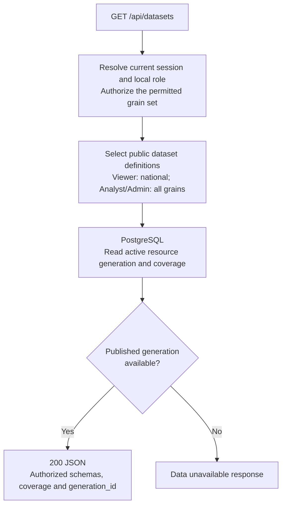

No S3 download or DuckDB execution. The payload exposes only public columns and authorized datasets.

## Dataset preview

`GET /api/datasets/{dataset}/preview`

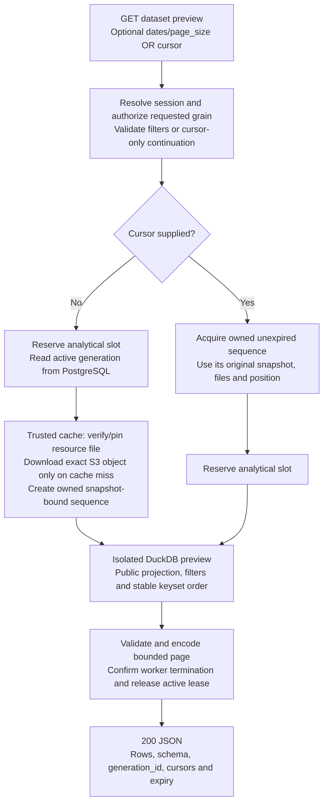

Both first-page and cursor requests recheck current permissions. Continuations do not switch generations. Unknown/forbidden datasets have safe errors; expiry/loss requires an explicit restart. The sequence retains its file pins until expiry/discard.

## Execute SQL

`POST /api/query`

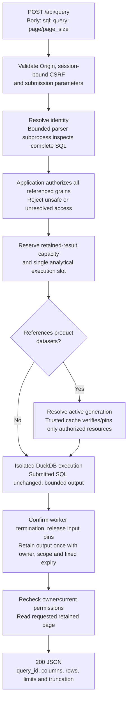

Invalid SQL, denied references, busy execution and exhausted bounds return explicit errors. Reference-free expressions have null generation identity. No pagination clauses are injected.

## Read SQL result page

`GET /api/query`

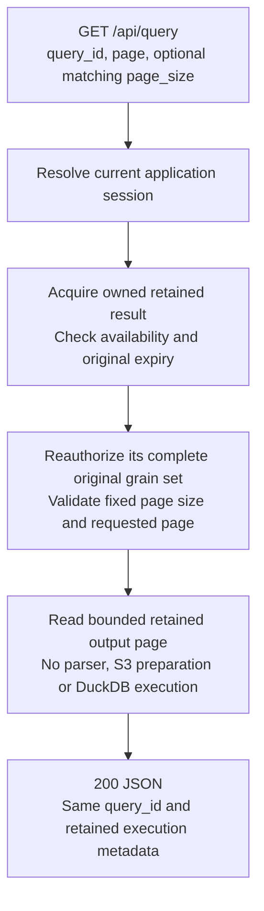

Foreign, expired or lost results return unavailable errors; invalid page/size requests are rejected. Neither GET nor expiry recovery silently reruns SQL.

## Admit refresh

`POST /api/refresh`

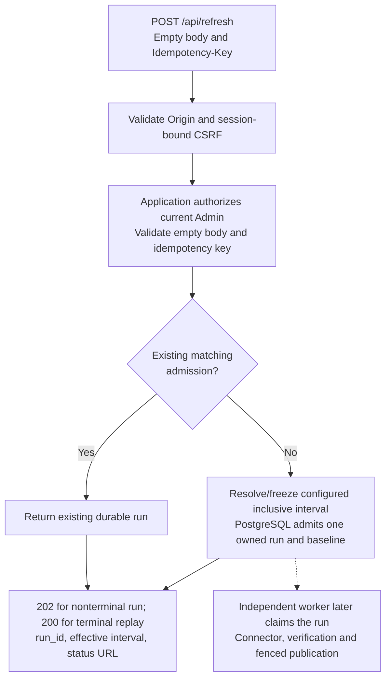

Admission performs no EIA retrieval or S3 upload. Dates/datasets cannot be overridden by the caller. The worker is independently supervised; browser/API lifetimes do not own it.

## Latest refresh

`GET /api/refresh/latest`

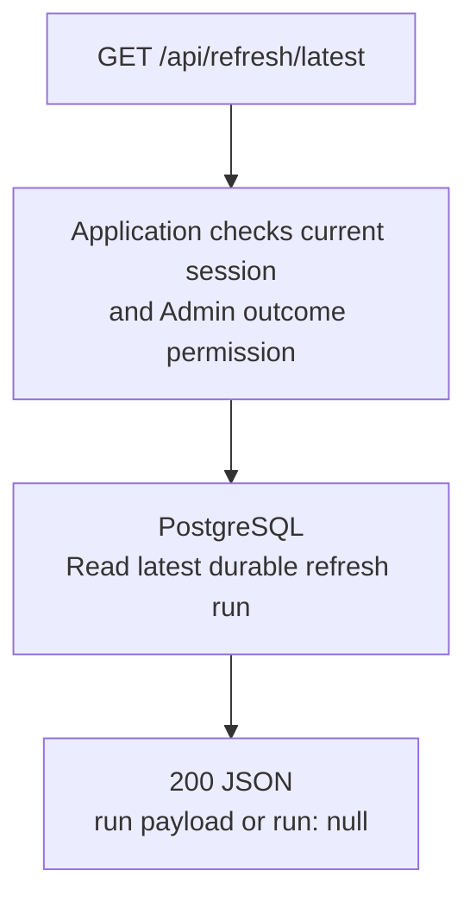

Status lookup starts no refresh and grants no permission to retry or publish. Database unavailability produces a safe unavailable response.

## Refresh status

`GET /api/refresh/{run_id}`

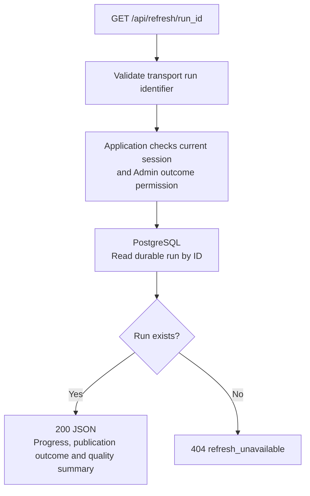

Only Admin can inspect outcomes, even when the ID is known. Polling reads recorded state; it does not run source work or infer publication from an S3 receipt.

## Sources

- [HTTP routes](../../../src/outage_explorer/entrypoints/http/routes/)
- [Application services](../../../src/outage_explorer/application/services/)
- [Data HTTP contract](../../specs/data-api/http-contract.md)
- [Authentication HTTP contract](../../specs/user-access/http-contract.md)
- [Connector and publication flow](data-connector.md)

[All module diagrams](../module-diagrams.md) · [Decisions](../../../DECISIONS.md)
