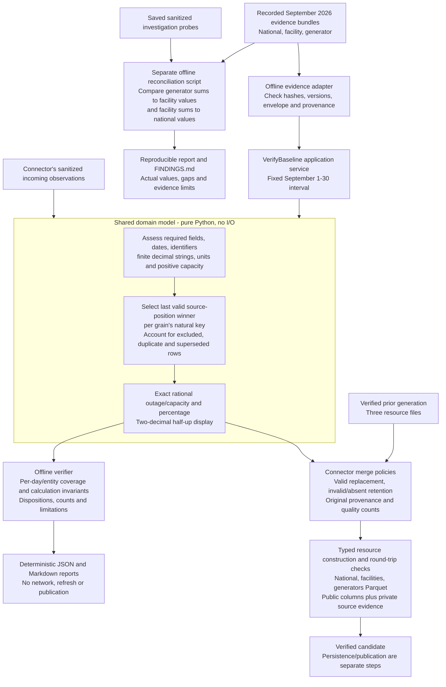

# Model and verification: high-level flow

Shared pure policies establish usable observations, deterministic selection and
exact arithmetic. The connector uses them to build resources; offline contributor
verification uses them to replay fixed recorded evidence. Cross-grain reconciliation
is a separate investigation, not part of the baseline verifier or a publication gate.

| Grain | Natural key | Public relation |
| --- | --- | --- |
| National | `period` | `national` |
| Facility | `(period, facility)` | `facilities` |
| Generator | `(period, facility, generator)` | `generators` |

Identifiers are strings; names are attributes. Keys are enforced within each
generation by processing/verification, not Parquet foreign-key constraints.
National values remain independent from detail sums. The prepared national
percentage is `100 × outage_mw / capacity_mw`, not an average of percentages.
Missing observations remain unavailable rather than becoming zero.

The shared policy box means code reuse, not two independent mathematical oracles.
Candidate verification checks stored representations against expected source and
merge results. Evidence integrity, known-result tests and explicit arithmetic
invariants provide additional checks; replay alone does not prove physical EIA
correctness or upstream completeness.

Run the three offline entry points `verify-national-data`, `verify-facility-data`
and `verify-generator-data` for per-grain reports. The separate
[reconciliation script](../../challenge/evidence/facility_row_count.py) processes
the recorded bundles and probes. It found zero capacity/outage gaps over the
30-day baseline; that does not establish source completeness. The response-count
discrepancy is a separate metadata finding. See [FINDINGS.md](../../../FINDINGS.md)
for the current anomaly evidence, including investigations beyond this baseline.

Sources: [observation policies](../../../src/outage_explorer/domain/observations.py),
[refresh policies](../../../src/outage_explorer/domain/refresh.py),
[baseline verifier](../../../src/outage_explorer/application/services/evidence.py),
[physical schemas](../../../src/outage_explorer/infrastructure/parquet/schemas.py),
[national contract](../../specs/national-data-verification/contract.md),
[detail contracts](../../specs/facility-generator-verification/contract.md).

[All module diagrams](../module-diagrams.md) · [ER diagrams](../data-model.md)
