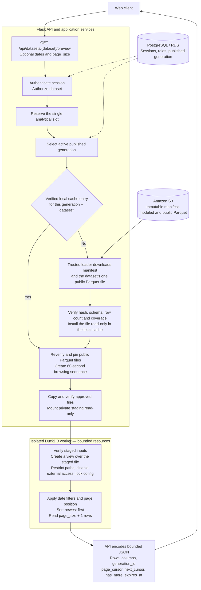
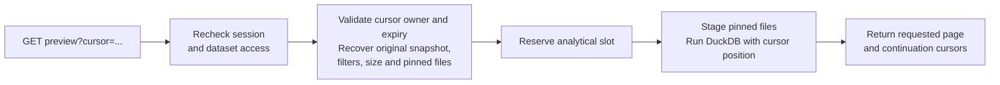

# Dataset preview flow

High-level view of the implementation, reviewed against source on **October 6,
2026**. The diagrams use Mermaid.

**The API selects a published snapshot, prepares verified local Parquet from S3,
and asks an isolated DuckDB worker for a page.** PostgreSQL holds access and
publication metadata; S3 holds the durable analytical files. A snapshot is one
published generation of the datasets.

## Endpoints

| Request | Purpose | S3 / DuckDB work |
| --- | --- | --- |
| `GET /api/datasets` | Return the caller's permitted datasets, schemas and published coverage. | Reads application definitions and PostgreSQL metadata; no S3 download or DuckDB execution. |
| `GET /api/datasets/{dataset}/preview?start_date=2026-09-01&end_date=2026-09-30&page_size=100` | Start browsing the active snapshot. Dates and page size are optional. | Prepare or reuse cached files, then execute a DuckDB preview. |
| `GET /api/datasets/{dataset}/preview?cursor=<opaque-value>` | Continue or revisit a page in the same browsing sequence. | Reuse its pinned files and execute another DuckDB preview. |

`{dataset}` is `national`, `facilities` or `generators`. Viewer has national
access; Analyst and Admin have all three. Every request checks the current
application session and role. Preview defaults to 100 rows, with a maximum of 500.

## First-page flow

The single execution slot is shared with SQL queries. A busy request is rejected
before first-page publication lookup or S3 preparation. The worker receives only
the approved read-only inputs, without S3 credentials, network access or access
to operational PostgreSQL.

### What happens at each data boundary?

1. **PostgreSQL selects the snapshot.** Its publication record contains the exact
   manifest identity and dataset summaries. Only a published generation can be
   served; an uploaded candidate alone is insufficient.
2. **The backend retrieves S3 objects.** On a cache miss, it reads the manifest
   metadata (`HeadObject`), then streams the manifest and the dataset's single
   public Parquet file (`GetObject`) to temporary disk. It checks byte counts and
   SHA-256 hashes, then verifies the file's schema, row count and period coverage
   against the manifest and the publication record, and installs it read-only in
   the cache. It never projects or rebuilds data. Modeled, raw evidence and
   provenance files are not fetched for preview.
3. **The cache retains prepared files.** Its identity is the manifest digest plus
   dataset ID. Cache hits reuse verified local files. A browsing sequence pins
   those files, protecting them from eviction while the sequence remains usable.
4. **DuckDB builds the page.** The worker exposes the staged Parquet as an
   `approved` view in a fresh DuckDB connection, readable only from the exact
   staged path, with external access disabled and configuration locked; no table is
   imported. It then applies inclusive date bounds and sorts by `period DESC`,
   followed by ascending
   binary UTF-8 facility/generator identifiers where applicable. Fetching one
   extra row determines whether another page exists.
5. **The API returns the public result.** It encodes rows aligned with `columns`,
   enforces the response byte bound, and creates the current and next cursors.
   Worker termination is confirmed and per-execution staging is cleaned up before
   the execution slot is released; the sequence's cache pin survives for browsing.

**Loading behavior:** a cold preview downloads one file for the selected dataset in
that generation, 1.7 MB for the largest dataset (generators) in the first published
six-month generation (facilities 0.9 MB, national 24 KB).
DuckDB scans it through the view, using date filters and Parquet statistics where
they apply ([ADR-0007](../../adr/0007-bounded-parquet-query-execution.md),
[ADR-0008](../../adr/0008-local-parquet-file-cache.md),
[ADR-0057](../../adr/0057-single-file-modeled-datasets.md)).

## Subsequent pages

- Continuations accept only `cursor`; dates and page size stay fixed.
- The cursor identifies a position after the previous page's final ordering key
  (keyset pagination). Reusing a visited `page_cursor` revisits that page.
- Each page runs DuckDB again against the same pinned snapshot. Preview retains
  sequence metadata and input files, whereas SQL pagination reads a retained
  execution result.
- Publishing a new generation does not change an existing sequence. A new
  first-page request selects the then-active generation.
- Cursor lifetime is fixed at 60 seconds from sequence creation, without renewal.
  Expired or lost state returns `410 preview_unavailable`, requiring a new browse.
  Cleanup releases expired sequences' file pins after active use finishes. A user
  may hold up to 100 live sequences ([ADR-0059](../../adr/0059-sixty-second-preview-result-lifetime-and-capacity.md)).

## Implementation map

Paths below are relative to `src/outage_explorer/`.

| Responsibility | Source |
| --- | --- |
| HTTP endpoints | `entrypoints/http/routes/datasets.py` |
| Catalog and preview orchestration | `application/services/catalog.py`, `application/services/preview.py` |
| Active publication lookup | `infrastructure/postgresql/publication.py` |
| S3 transfer and integrity checks | `infrastructure/s3/artifacts.py` |
| Verified public Parquet cache | `infrastructure/local_cache/modeled.py` |
| Snapshot-bound cursor state | `infrastructure/query_results/previews.py` |
| Admission, private staging and worker launch | `infrastructure/worker_runtime/launcher.py`, `inputs.py`, `docker.py` |
| DuckDB preview query | `infrastructure/duckdb/previews.py` |
| Concrete dependency wiring | `bootstrap.py` |

See the [HTTP contract](http-contract.md#dataset-preview) for response fields and
errors, and [ADR-0015](../../adr/0015-dataset-preview-pagination.md) for snapshot
and expiry behavior.
