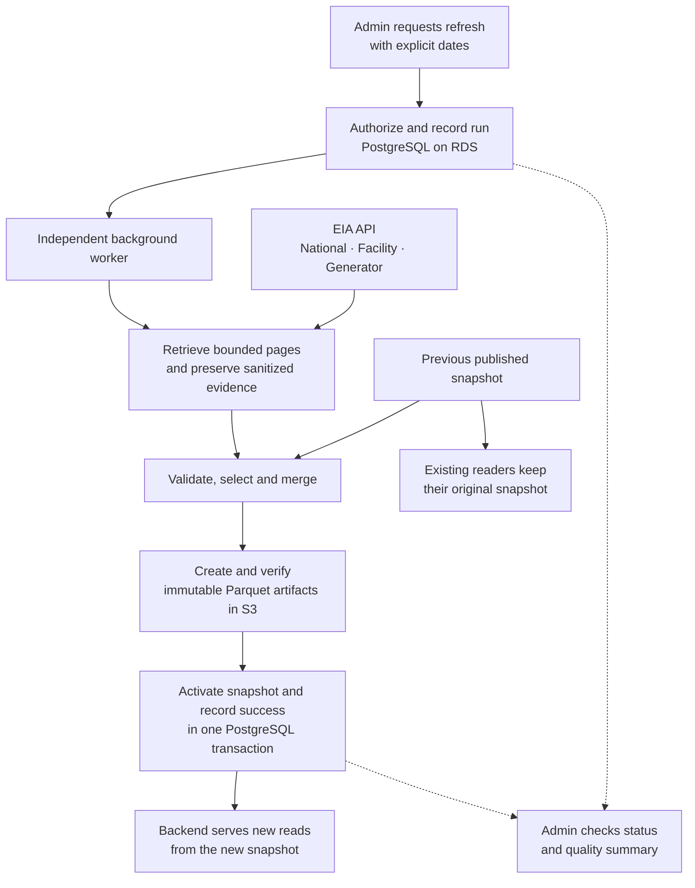
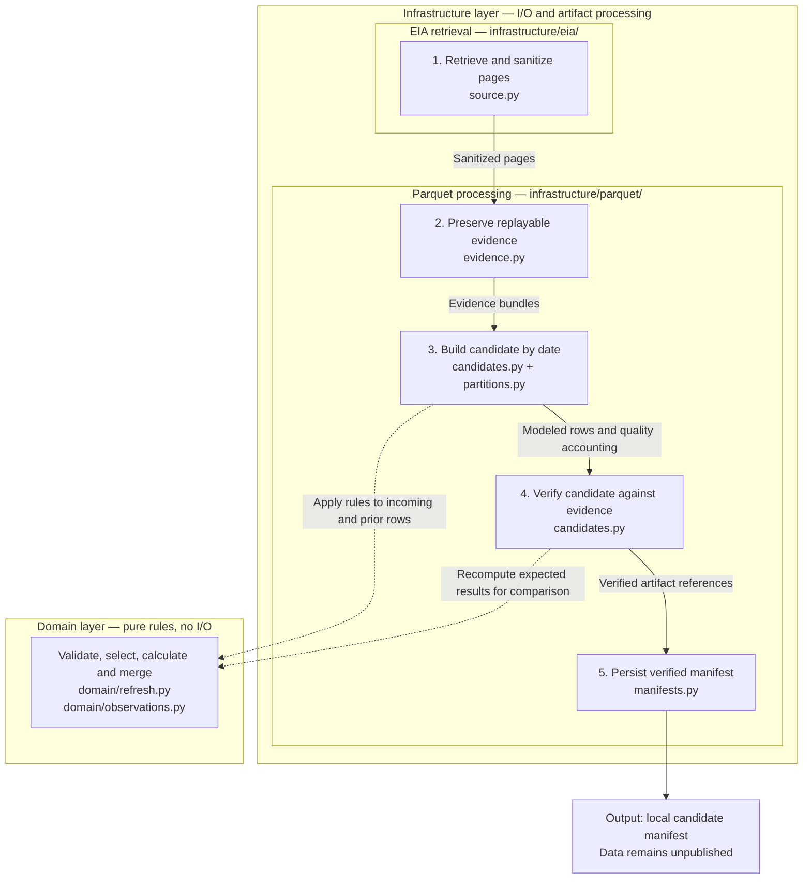

# Data connector flow and implementation

The connector retrieves EIA nuclear outage observations at national, facility,
and generator level, preserves their evidence, and builds validated datasets.
Retrieval, transformation, and local Parquet verification are implemented.
Authorized background refresh and durable publication remain planned.

Status reviewed on **October 4, 2026** against the current source and
[task tracker](tasks.md): phases 1–3 are complete; phases 4–6 are pending.
The diagrams below use Mermaid. Open this document in a Markdown preview
with Mermaid support to view them as diagrams.

## Planned end to end flow

An Admin requests an explicit date interval. A background worker retrieves all
three datasets, validates and merges observations, and automatically publishes
a complete verified generation. A generation is a snapshot of the three
datasets together with references to their supporting evidence.

This diagram describes the target workflow. PostgreSQL coordination, S3
publication, refresh authorization, worker supervision, and product readers
are not implemented by the current connector components.



The publication path applies to eligible candidates that pass every check.
The previous generation remains available during refresh and after failure.
An entirely excluded refresh retains the active generation without publishing.
The first load has no prior snapshot and requires usable output from all three
datasets for **April 2–October 1, 2026, inclusive**. Subsequent refreshes also use
explicit dates; automatic scheduling is deferred.

After the current work is complete, a deferred
[new data status card](../../adr/0040-defer-new-data-status-card.md) will notify
users whose displayed data is from an older snapshot and offer an explicit
view refresh. This does not start ingestion or add a publication approval step.
The backend assigns the active snapshot to new reads; existing continuations
remain bound to their original snapshot/execution.

These behaviors follow [automatic publication](../../adr/0003-admin-refresh-publication.md)
and [initial loading and retention](../../adr/0037-connector-initial-load-and-retention.md).
The [implementation plan](plan.md) describes proposed coordination and recovery
mechanisms; the diagram does not settle their remaining runtime choices.

## Implemented components

The current code exposes programmatic components used by local tests. It ends
with a persisted, verified local candidate manifest, which describes the data
files and evidence dependencies. That manifest does not activate product data.

Read the numbered stages from top to bottom. Boxes are grouped by their owning
Python packages under `src/outage_explorer/`. **Solid arrows** show data moving
between stages; **dashed arrows** show calls to shared domain rules. The local
caller connects retrieval and candidate construction; these packages are parts
of the same application.



Stage 3 also accepts an optional previous candidate. Stage 4 rereads the raw
evidence and any inherited evidence to check the result. Both reuse the same
domain rules; validation and merge decisions do not perform storage operations.

| Higher level module | Files and responsibilities |
| --- | --- |
| **EIA retrieval** — `infrastructure/eia/` | `source.py` drives metadata and sequential page retrieval. `transport.py`, `sanitization.py`, and `quality.py` support safe HTTP handling, credential removal, and source coverage accounting. |
| **Parquet processing** — `infrastructure/parquet/` | `evidence.py` preserves and replays input; `partitions.py` forms bounded date groups; `candidates.py` builds and verifies the candidate; `manifests.py` persists its references. |
| **Shared local storage** — `infrastructure/parquet/` | `storage.py` and `schemas.py` supply bounded immutable file I/O, hashes, and typed Parquet schemas for the processing stages. |
| **Observation and refresh rules** — `domain/` | `observations.py` validates and selects observations and calculates exact values. `refresh.py` applies modeling, replacement, retention, provenance, and quality-accounting rules. |
| **Shared contracts** — `application/ports/` | `source.py`, `artifacts.py`, and `candidates.py` define interfaces and data types such as sanitized pages, evidence bundles, and candidate manifests. These contracts are not an implemented refresh orchestration service. |

Selection collapses identical duplicates and uses the last valid observation
in recorded source order; that order does not prove revision recency. Merge
replaces matching keys with valid observations and retains previous valid data
for identifiable invalid replacements or absent keys, preserving its original
provenance.

"Raw evidence" means sanitized observations and metadata, not original wire
bytes. All three grains remain independent; national metrics use national
observations rather than sums of facility or generator rows.

If only some nonempty datasets have every incoming observation excluded, their
previous data survives while other datasets contribute valid updates. If all
three are excluded, the local outcome indicates retention without publication.
Empty required datasets, failed retrieval, exhausted limits, and corrupt
artifacts remain failures. The facility advertised-total discrepancy alone is
a visible diagnostic.

## Implemented component sequence

This sequence shows how existing component calls compose under a local caller
or test harness. The source tests inject controlled HTTP responses. There is
no production refresh application service or worker wired to drive this whole
sequence yet. Verification failure raises an error rather than returning a
successful candidate.

```mermaid
sequenceDiagram
    actor Caller as Local caller / test
    participant Evidence as Evidence writer
    participant Source as EIA adapter
    participant Store as Local Parquet store
    participant Builder as Candidate builder
    participant Rules as Domain policies

    loop National, facility and generator
        Caller->>Evidence: write_evidence(store, source.pages())
        loop Pages until empty terminal page
            Evidence->>Source: Request next page
            Source->>Source: Fetch/cache metadata; request page via HTTP
            Source->>Source: Apply retries, limits, sanitization and checks
            Source-->>Evidence: Sanitized page with provenance
            Evidence->>Store: Write raw rows and page metadata
        end
        Evidence->>Store: Read back and verify evidence
        Evidence-->>Caller: Evidence bundle
    end

    Caller->>Builder: build(generation, bundles, bounds, optional prior)
    opt Previous candidate supplied
        Builder->>Builder: Verify previous candidate and dependencies
    end
    loop Each dataset and complete date group
        Builder->>Store: Read incoming evidence and prior rows
        Builder->>Rules: Validate, select, calculate and merge
        Rules-->>Builder: Rows, dispositions and retention decisions
        Builder->>Store: Write modeled data and accounting artifacts
    end
    Builder->>Store: Replay evidence and read candidate artifacts
    Builder->>Rules: Recompute expected results
    Builder->>Builder: Verify values, provenance, uniqueness and counts
    Builder->>Store: Persist immutable manifest
    Builder-->>Caller: Verified local candidate or retained outcome
    Note over Caller,Store: No S3 publication or active-generation update yet
```

The implementation is in the [source adapter](../../../src/outage_explorer/infrastructure/eia/source.py),
[evidence writer](../../../src/outage_explorer/infrastructure/parquet/evidence.py),
[candidate builder](../../../src/outage_explorer/infrastructure/parquet/candidates.py),
and [domain refresh policies](../../../src/outage_explorer/domain/refresh.py).
Local adapter and replay behavior is exercised by the
[source tests](../../../tests/integration/test_eia_source.py) and
[candidate tests](../../../tests/integration/test_connector_parquet.py).

## Remaining implementation

| Phase | Remaining work |
| --- | --- |
| [4 — Durable publication](tasks/phase-4.md) | PostgreSQL run records and worker ownership; S3 upload and readback verification; atomic active-generation updates and crash reconciliation. |
| [5 — Authorized orchestration](tasks/phase-5.md) | Admin authorization, refresh application services, supervised worker, refresh/status endpoints, and an initial-load command. |
| [6 — Live enablement](tasks/phase-6.md) | Broader live pagination/order evidence, measured operating limits, full initial-load rehearsal, and recovery with EIA unavailable. |

Recorded September verification and bounded
[live facility probes](../../challenge/001-facility-row-count.md) provide evidence
for specific observations. They do not establish production publication,
runtime authorization, complete upstream coverage, or supported resource limits.
