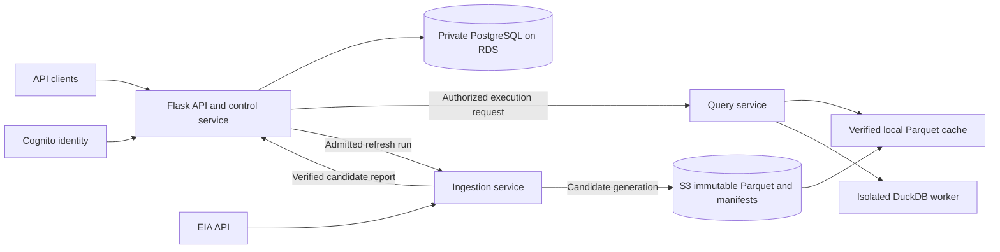
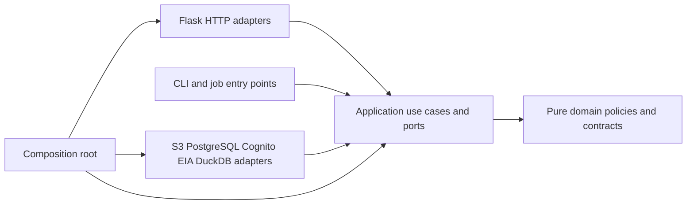

# Flask architecture options and selected structure

Status: **layered monolith accepted**, [ADR-0030](../../adr/0030-layered-flask-monolith.md).
Concrete runtime arrangements below remain proposals. Researched on 2026-10-01;
no application implementation or runtime benchmark exists.

Use a **layered Flask monolith** with `domain`, `application`, `infrastructure`,
and `entrypoints`, wired through one composition root. The authoritative
[code structure guide](../../context/code-structure.md) defines package placement,
allowed imports, agent rules, and required future automated checks.

This design serves the [existing specification](spec.md): authorized exploration
of backend-owned EIA data, reproducible findings, and safe refresh without
interrupting readers. It preserves S3, Parquet, DuckDB, PostgreSQL on RDS, Cognito, and
one ECS backend replica. It does not require a new broker or distributed database.

## Constraints that determine the architecture

| Requirement | Architectural consequence |
| --- | --- |
| Viewer sees national data only; authorization covers every access path (FR5–FR10, FR15) | Central application policy, enforced before analytical reads, with restricted worker inputs |
| Broad read-only SQL with bounded execution (FR9–FR10, TR3) | Separate SQL inspection, authorized data preparation, and isolated execution |
| One execution supplies numbered result pages (FR9a) | One owner of bounded, expiring query metadata and retained results; no reruns for pagination |
| Queries work without EIA after ingestion (FR4, FR16) | Read use cases access published storage; only ingestion calls EIA |
| Automatic publication after background refresh (FR3, FR11) | Durable run state, one refresh owner, immutable generations, one publication commit |
| Invalid records and revisions follow accepted policies (FR2–FR3a) | Pure validation/merge policies shared by ingestion and verification |
| S3 data and operational state survive replacement (TR8) | Separate durable Parquet and PostgreSQL lifecycles; disposable cache and query state |
| Evidence must reproduce actual findings (FR12–FR14) | Versioned contracts, provenance, pinned inputs, and callable verification use cases |

Initial controls remain one analytical worker, a 10-second execution deadline,
and 1,000 rows or 1 MiB total serialized result, with explicit truncation.
Preview defaults remain 100 rows, maximum 500, and a fixed 15-minute cursor.
Query-result TTL/page sizes and other resource budgets remain open.

National validation also follows the newly accepted [ADR-0027](../../adr/0027-national-required-values-and-positive-capacity.md):
required values include EIA's reported percentage, units must be compatible,
and capacity must be positive. Invalid observations leave visible coverage
gaps; zero outage with valid positive capacity yields 0%. Parsing details,
rounding/tolerance, and conflicting-observation resolution remain open.

## Three options considered

These are project-specific assessments, not performance measurements.
Layering describes code organization; a monolith describes an application and
release boundary. They work together. Clean Architecture dependency rules can
be used in either a layer-first or a feature-first monolith.

| Option | Organization | Strength for this project | Cost and limitation | Outcome |
| --- | --- | --- | --- | --- |
| A. Layered Flask monolith | Entry points, application services, pure domain policies, infrastructure adapters | Simple layout with shared policies and one release | Requires explicit import rules and tests to prevent layer bypasses | **Selected**, with application-owned interfaces and documented boundaries |
| B. Feature-first modular monolith | Each feature contains its own domain/application packages | Explicit feature ownership with the same dependency principles | More package boundaries and structure to maintain | Earlier proposal; replaced by the user's layer-first choice |
| C. Independently deployed services | API, ingestion, and queries communicate through network contracts | Independent release and capacity when required | Adds authenticated delegation, retries, and state ownership across services | Explanatory alternative; deferred |

The selected structure retains dependency inversion at external boundaries:
application services call small interfaces, and bootstrap supplies adapters.
A folder named `services/` alone does not establish these boundaries. Isolated
query workers remain execution boundaries within the monolith.

The principles come from the original
[Clean Architecture description](https://blog.cleancoder.com/uncle-bob/2012/08/13/the-clean-architecture.html)
and [hexagonal architecture](https://alistair.cockburn.us/hexagonal-architecture).
The Python-specific reference is Cosmic Python's
[Flask service layer](https://www.cosmicpython.com/book/chapter_04_service_layer)
and [repository discussion](https://www.cosmicpython.com/book/chapter_02_repository).
Our layout, storage ownership, and worker lifecycle are project-specific design
choices, not prescribed by those sources.

## Independent services example

This is an illustrative alternative, not the chosen deployment. A split for
Outage Explorer could have three independently built and deployed services:

Arrows show conceptual requests/data flow, not complete networking or trust
configuration. Each service would have its own deployment, health checks,
credentials, capacity settings, and versioned internal API.

| Service | Responsibility | State and credentials |
| --- | --- | --- |
| API and control | Verify user sessions, own product permissions/catalog, admit refresh, and commit publication | Sole owner of operational PostgreSQL and the active-generation reference; verifies Cognito identity |
| Query | Validate authorized requests, prepare exact inputs, run DuckDB sandbox, and serve retained result pages | Owns cache and expiring query state; trusted preparation can read authorized S3 objects, isolated workers receive no cloud credentials |
| Ingestion | Fetch EIA pages, validate/model data, upload immutable candidate generations, and report quality | EIA credentials and candidate-write permissions; cannot directly modify operational PostgreSQL or activate a generation |

For example, an Analyst submits SQL to the API. After checking session and
permissions, the API delegates a request bound to a principal, permitted data
scope, policy version, limits, and pinned generation. The query service verifies
the internal caller and delegation, inspects references against that scope,
prepares inputs, and executes once. Later page requests return through the API
for current authorization and go to the same query-state owner. A plain forwarded
`role=Analyst` field is not a trusted authorization protocol.

An Admin refresh would first create an admitted run in the API's database.
The ingestion service processes that run and reports the candidate manifest
and quality outcome. The API verifies the report and candidate, then commits
publication and run success. Duplicate completion messages must be idempotent;
lost requests, interrupted jobs, expired ownership, and uncertain replies need
reconciliation. The split moves local lifecycle coordination across a network.

Services would not directly read or write each other's private database tables. In this example only the control service needs an operational database;
the other two own their temporary state and exchange explicit contracts.
Keeping service-owned persistence private follows the
[AWS database-per-service guidance](https://docs.aws.amazon.com/prescriptive-guidance/latest/modernization-data-persistence/database-per-service.html).
The specific allocation above is our hypothetical design, not an AWS template.

The benefit would be deploying an ingestion fix without releasing the public
API, or assigning query processing its own capacity. The costs are authenticated
internal calls, contract compatibility, retry/idempotency protocols, state routing,
and cross-service tracing. Scaling query replicas would also require revisiting
the accepted global execution limit and query-state ownership. A broker could
be evaluated if needed; this example does not select one.

For the chosen monolith these calls stay inside one codebase and release.
Separate processes/containers for safety and background work remain possible
without adopting independently deployable product services.

## Dependency rules

Arrows show **source-code dependencies**, not runtime data flow. At runtime,
a use case calls a port implemented by an injected adapter.

- **Domain:** plain Python types and functions for dataset contracts, metric
  calculation, validation, duplicate/revision policies, and permission rules.
  No Flask, SQLGlot, DuckDB, PyArrow, PostgreSQL, HTTP, or AWS imports.
- **Application:** named use cases, transaction boundaries, authorization
  ordering, and port contracts. Depends on domain and explicit application contracts; no Flask context or concrete infrastructure imports.
- **Adapters:** HTTP parsing/serialization and implementations of external
  capabilities. Translate SDK responses, rows, and engine errors into
  application types. SQLGlot ASTs stay inside the SQL adapter.
- **Composition root:** constructs adapters and injects them into use cases.
  It is the place allowed to know all concrete implementations.

Use dataclasses and small `typing.Protocol` interfaces where an external
dependency or lifecycle needs substitution. Prefer ordinary functions for pure
calculations. Introduce a repository for meaningful operational persistence,
not a generic CRUD superclass or an ORM entity for every analytical row.
Batch processing may remain inside a data adapter, applying pure rules to
bounded batches; whole datasets must not cross a boundary as Python objects.

## Capability ownership within the layers

The canonical directory layout and import matrix live in the
[code structure guide](../../context/code-structure.md). Group these capabilities
inside the layers instead of creating independent feature-layer trees:

| Capability | Application services | Domain responsibility |
| --- | --- | --- |
| Access | Resolve principal/session, authorize operation, end current session | Permission and policy types/rules |
| Datasets | Catalog, generation resolution, evidence reproduction | Schema contracts, metric, validity and provenance rules |
| Exploration | Preview, execute SQL, fetch result page | Applicable data-scope rules and dataset contracts |
| Refresh | Admit/execute refresh, get outcome, publish generation | Validation, duplicate/revision and retained-valid-row policies |

Use direct application calls with explicit dependencies. Keep access independent
of query/refresh workflows. Shared domain policies must not call application
services; infrastructure must not own business orchestration. HTTP Blueprints
organize routes but do not enforce these import rules.

## Flask integration

Use `create_app(settings, services)` to register Blueprints, request validation,
authentication hooks, and error handlers. Construct production services in the
composition root; inject fakes in tests. Flask's
[application factory](https://flask.palletsprojects.com/en/stable/patterns/appfactories/)
supports configurable app instances, and
[Blueprints](https://flask.palletsprojects.com/en/stable/blueprints/)
provide modular HTTP registration.

Each route parses and validates its request, obtains a trusted principal,
calls one use case, and maps the result to JSON. Use cases enforce authorization
so a CLI or job entry point cannot bypass a decorator-only check. Do not pass
`request`, `g`, `current_app`, database connections, or SDK clients as domain
objects. Context-local conveniences stay in HTTP adapters.

Map typed failures consistently: unauthenticated, forbidden, invalid query,
busy, deadline exceeded, unavailable continuation, and dependency failure.
Document exact status codes and request/response schemas before implementation.
Flask requires an explicit validation and OpenAPI approach; select one boundary
library during implementation rather than adding several overlapping extensions.

## Ports and selected tools

The names below illustrate capability boundaries, not a requirement for one
class per table or method.

| Application capability | Adapter and tool | Selection status |
| --- | --- | --- |
| `IdentityVerifier` | Cognito signing-key and access-token validation | Cognito selected; Python OAuth/JWT package open |
| `AccessStore`, `SessionStore`, `RefreshStore`, `PublicationStore` | PostgreSQL with short transactions | PostgreSQL on RDS selected; driver/ORM choice open |
| `SourceReader` | EIA pagination and bounded HTTP retries | HTTPX candidate from prior plan |
| `ModelWriter` | Batched raw/modeled Parquet | Parquet selected; PyArrow candidate |
| `SnapshotStore`, `InputCache` | S3 object storage and verified local files | Selected capabilities; AWS SDK/version open |
| `SqlInspector` | Parse references/functions into an application-owned description | SQLGlot candidate; compatibility gate required |
| `QueryExecutor` | DuckDB in an isolated worker | DuckDB selected; sandbox launcher open |
| `QueryResultStore` | Bounded in-memory metadata and bounded retained output | Metadata behavior selected; format/TTL/budgets open |

`QueryExecutor` receives a trusted authorized query plan with a pinned snapshot,
permitted relations, enforced policies, and resource limits. Callers cannot
supply arbitrary object keys or mount paths. A plain SQL string from a route
is not sufficient authority to launch a worker.

## SQL execution and pagination

1. Resolve an active application session and current permissions. Apply request
   size, parse-depth, and parsing-time limits before expensive work.
2. Inspect the full statement, including nested/unused CTEs, subqueries,
   functions, and qualified references. Authorize every data source and applicable
   row/column policy before fetching analytical files or planning in DuckDB.
3. Acquire the single analytical execution slot. Pin one committed generation,
   resolve exact permitted objects, and reuse or download checksum-verified
   files through the bounded cache. Downloads and preparation have a separate
   deadline; they do not consume an unbounded prelude to the execution deadline.
4. Launch a restricted worker with only the authorized inputs, bounded scratch,
   no network or credentials, and enforced CPU/memory/time limits. Enforce
   policies through authorized relations and deny access to backing files or
   alternative functions that would bypass them. Concrete granular policies
   and their enforcement proof remain a readiness gate.
5. Execute once and retain its result sequence under the existing total caps.
   Do not inject sorting, LIMIT, or OFFSET for pagination. Record whether the
   result was truncated, and return an opaque query ID bound to principal,
   generation, permission scope, execution, and fixed page size.
6. Serve subsequent numbered pages from retained output. Recheck the session
   and permissions each time; conservatively invalidate continuation if its
   policy scope changed. Expiry/restart yields explicit unavailable state.
   A rerun is a new, explicit execution with a new ID.

Release the execution slot after killing/reaping the worker and closing its
inputs, including on failure. Continuations retain the bounded result, so
they need not keep analytical cache files pinned. Result cleanup must be
independent of user requests, quota-aware, and synchronized with active readers.
Preview uses its own deterministic snapshot cursor; it is not SQL-result paging.

DuckDB documents untrusted SQL as code execution requiring a sandbox; engine
settings alone do not provide that isolation.
[DuckDB security guidance](https://duckdb.org/docs/current/operations_manual/securing_duckdb/overview)
supports this execution boundary. Broad analytical features remain required;
parser limitations must be demonstrated and documented, not used to silently
reduce the product to single-table queries.

## Background refresh and publication

`RequestRefresh` authorizes the Admin and records a run with idempotency and
single-refresh admission in a short PostgreSQL transaction. It returns a run ID
for polling. A separately supervised refresh process claims the accepted run
and executes it using the same application/domain code without a Flask context.
This is a proposed local dispatch mechanism, not an existing durable queue.

The worker fetches complete source pages, preserves raw evidence, applies
validation/deduplication/merge policies, and produces the Admin quality report.
Invalid rows are excluded; identifiable invalid replacements retain older valid
rows and their provenance. An all-excluded run records no publication and keeps
the current data. Incomplete retrieval remains a run failure. Within-run recency
ties, completeness, and removal rules still require source evidence.

Upload each candidate generation under new keys, then verify its objects and
manifest. In one short operational transaction, compare the expected prior
generation, change the active manifest reference, and record the successful
outcome. Query readers stay pinned to their original generation. S3 uploads
occur outside the PostgreSQL transaction; publication is the application visibility
boundary, not a cross-store transaction. This follows the existing
[integrity proposal](plan.md#duplicate-prevention-and-data-integrity).

Recovery takes exclusive ownership, checks the durable commit, and classifies
unfinished runs before accepting new work. Reconcile published success before
marking an interrupted run; do not blindly retry ingestion or publication.
The dispatcher must find accepted runs even if the HTTP process dies immediately
after the admission commit. Running jobs require explicit interruption handling;
automatic execution retries are not assumed.

Do not start refresh in a route, module import, or application factory.
Flask's [async documentation](https://flask.palletsprojects.com/en/stable/async-await/)
explains that view-created asynchronous tasks do not survive the request's
event loop. A broker-backed queue remains an alternative if durable retries,
multiple workers, or scheduling later justify it.

## Runtime and storage ownership

**Proposed starting topology:** one ECS backend deployment, one Gunicorn WSGI
application worker process with a measured thread count, one supervised refresh
process, and at most one isolated analytical worker at a time. These are distinct
roles; one API replica does not automatically make all internal state shared.
[Flask's Gunicorn deployment guide](https://flask.palletsprojects.com/en/stable/deploying/gunicorn/)
documents the WSGI integration; the process count here is our design choice.

The API worker owns thread-safe query admission and the ephemeral query-ID
store. Multiple WSGI worker processes would fragment that state and invalidate
this arrangement; changing their count requires an explicit shared-owner design.
Worker replacement may lose query continuations, as ADR-0022 permits. Time out
requests and reap isolated work so a stalled query does not consume all request
capacity. API and infrastructure timeouts must accommodate the bounded
preparation, execution, and cleanup deadlines.

Startup and replacement must fence the previous owner and terminate/reap its
remaining query workers before admitting new queries; resetting a process-local
semaphore alone is insufficient. Initialize state after the WSGI worker starts,
and do not fork live database connections or launch jobs from `create_app`.
Record request/run IDs, generation IDs, outcomes, preparation/execution timings,
cache usage, admission failures, and resource-limit failures. Keep tokens,
credentials, and detailed result rows out of ordinary logs. Readiness requires
validated storage ownership and completed recovery; query failure must leave
the API able to serve status and other permitted requests.

| State | Owner and lifecycle |
| --- | --- |
| Raw/modeled Parquet, manifests, evidence inputs | S3; immutable published generations retained |
| Local identities, roles, sessions, refresh outcomes, active-generation reference | PostgreSQL on RDS; never accessible to analytical workers |
| Verified analytical cache | Disposable local disk; quota and pins prevent eviction during reads |
| Query IDs and retained results | API process memory plus optional bounded local spool; expire and may disappear on replacement |
| Query scratch and refresh staging | Separate temporary budgets; abandoned files reclaimed safely |

PostgreSQL on Amazon RDS now owns durable operational state (ADR-0032),
independently of ECS task and host lifecycles. The backend connects to the
database; no live database file or host-managed database volume is mounted
into ECS. [RDS PostgreSQL documentation](https://docs.aws.amazon.com/AmazonRDS/latest/UserGuide/CHAP_PostgreSQL.html)

API and trusted refresh processes use bounded connection pools, short
transactions, connection/statement/lock deadlines, and serialized migrations.
Do not share live connections across a process fork or hold transactions across
EIA/S3 calls or analytical execution. Reconcile uncertain publication commits
by durable run identity before retrying. Integration tests use PostgreSQL;
unit tests may use fakes behind application ports.

Design private RDS connectivity and TLS with certificate and hostname
verification. Database credentials stay in trusted application processes;
query workers have neither database credentials nor network access.
[RDS TLS guidance](https://docs.aws.amazon.com/AmazonRDS/latest/UserGuide/PostgreSQL.Concepts.General.SSL.html)
Version, sizing, pools, migration tooling, credentials, availability configuration,
and recovery policy require concrete decisions; no resources are provisioned.

ADR-0032 replaces the SQLite-specific EC2/EBS proposal in ADR-0011. ECS remains
selected, with EC2 versus Fargate still open. Analytical scratch/cache and the
restricted query launcher must fit the selected platform. Replacement still
needs to fence prior refresh/query owners; a network database does not provide
that application coordination automatically. Do not assume a host Docker socket.

## Authentication boundary

Cognito establishes identity; PostgreSQL determines product permissions. The
identity adapter verifies signature, trusted issuer, expiration, access-token
purpose, and the intended app client (`client_id` for Cognito access tokens),
plus resource audience/scopes where configured. It maps verified issuer/subject
to a seeded local user. External group claims do not independently grant access.
[Cognito token verification](https://docs.aws.amazon.com/cognito/latest/developerguide/amazon-cognito-user-pools-using-tokens-verifying-a-jwt.html)

The application must also enforce the accepted one-hour session and immediate
current-session logout. A valid JWT signature alone cannot establish whether
our application session is active. Keep session checking behind an application
port and finalize token/session mapping, concurrent-login behavior, and effective
expiry before implementation. Cognito owns passwords; no application password
hashing subsystem is needed for the selected login design.

## Verification and implementation order

| Evidence required | What it establishes |
| --- | --- |
| Import checks plus use cases tested without Flask/AWS/database context | Dependency direction and practical testability |
| Pure-policy fixtures for invalid rows, duplicates, retained valid rows, and metric edge cases | Domain correctness after outstanding source rules are resolved |
| Real adapter tests for PostgreSQL rollback, S3/cache checksums, and Parquet round trips | Port implementations honor their contracts |
| Sandbox tests with hostile SQL plus valid joins/CTEs/subqueries/windows | Both authorization isolation and useful analytical support |
| Cross-route and continuation tests for each persona, logout, and changed policies | Consistent permissions and pagination semantics |
| Crash tests before/after upload, admission, and publication commit | No partial publication or lost accepted run |
| Concurrent requests, API replacement, and refresh with EIA unavailable | State ownership, data persistence, and declared interruption behavior |

Start with the pending national-data verification, then prove the SQL sandbox
and RDS connectivity/recovery arrangement. Build a vertical slice through Flask,
application policy, and an authorized national preview before broadening the
API. Add SQL continuation and controlled refresh using the same boundaries;
complete cross-grain reconciliation and three evidence-backed findings under
the existing plan. This research does not settle source field contracts or
claim the application acceptance tests have passed.

## Decisions still required

The layered monolith is accepted in
[ADR-0030](../../adr/0030-layered-flask-monolith.md), replacing the earlier
ADR-0029 structure proposal. Flask supersedes
FastAPI under [ADR-0028](../../adr/0028-python-flask-backend.md).
Before implementation depends on them, resolve:

- ECS launch/scratch/launcher design, RDS configuration/connectivity, single-owner replacement, and interruption expectations.
- Cognito client configuration and exact application-session mapping.
- Concrete granular data policies and SQLGlot/DuckDB compatibility evidence.
- Source completeness, schema/merge contracts, and metric edge cases.
- Measured worker/cache/storage limits, query-result TTL/page sizes, and HTTP schema library.

Revisit independent services only for demonstrated capacity, ownership, or
availability needs. Until then, keep one codebase, direct use-case calls,
explicit external boundaries, and independently bounded execution workers.
